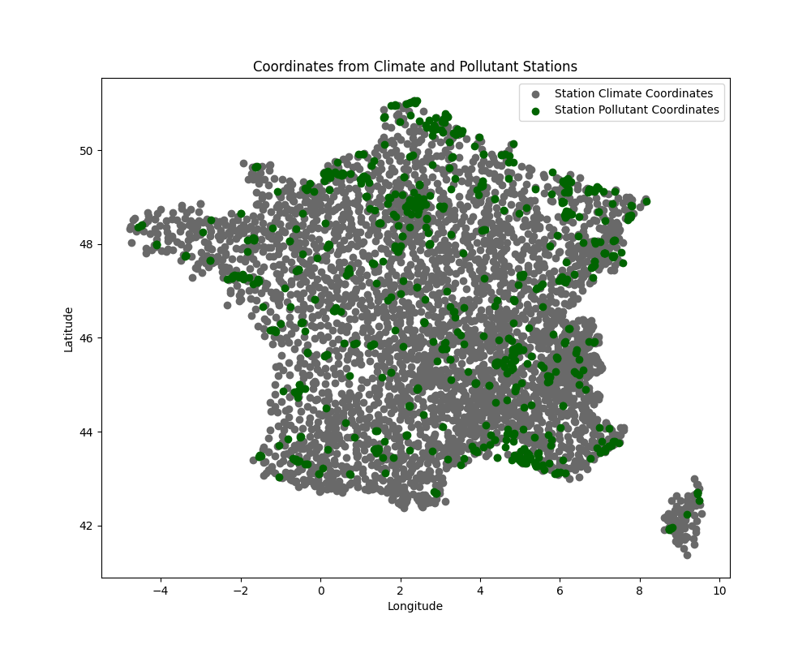

# Pollution Forecast App

This repository contains the script and documentation for the project we completed during data science training. The goal is to create a web application that can predict pollution based on previous records and provide the results in a comprehensive dashboard.

## Part 1: Data

### Subpart 1: Pollutant

We get data from [data.gouv.fr](https://www.data.gouv.fr/fr/datasets/donnees-temps-reel-de-mesure-des-concentrations-de-polluants-atmospheriques-reglementes-1/).

We collected data in CSV format from 2021 to now ([link](https://files.data.gouv.fr/lcsqa/concentrations-de-polluants-atmospheriques-reglementes/temps-reel/)), but before 2021 ([link](https://files.data.gouv.fr/lcsqa/concentrations-de-polluants-atmospheriques-reglementes/old/)) it was only available in XML. To download this data, I used Talend Open Studio because it is well-suited for data loading. Here is the job schema I used to download the CSV and XML files and the Python scripts for converting XML to CSV.

#### Job 2021 to Now (CSV Format)


(Add more information about the different components that I used...)

Example of CSV file (from FR_E2_2021-10-22.csv):

```
Date de début;Date de fin;Organisme;code zas;Zas;code site;nom site;type d'implantation;Polluant;type d'influence;discriminant;Réglementaire;type d'évaluation;procédure de mesure;type de valeur;valeur;valeur brute;unité de mesure;taux de saisie;couverture temporelle;couverture de données;code qualité;validité
2021/10/22 00:00:00;2021/10/22 01:00:00;ATMO GRAND EST;FR44ZAG02;ZAG METZ;FR01011;Metz-Centre;Urbaine;NO;Fond;A;Oui;mesures fixes;Auto NO Conf meth CHIMILU;moyenne horaire validée;1.1;1.1;µg-m3;;;;A;1
2021/10/22 01:00:00;2021/10/22 02:00:00;ATMO GRAND EST;FR44ZAG02;ZAG METZ;FR01011;Metz-Centre;Urbaine;NO;Fond;A;Oui;mesures fixes;Auto NO Conf meth CHIMILU;moyenne horaire validée;0.8;0.8;µg-m3;;;;A;1
2021/10/22 02:00:00;2021/10/22 03:00:00;ATMO GRAND EST;FR44ZAG02;ZAG METZ;FR01011;Metz-Centre;Urbaine;NO;Fond;A;Oui;mesures fixes;Auto NO Conf meth CHIMILU;moyenne horaire validée;;;µg-m3;;;;N;-1
2021/10/22 03:00:00;2021/10/22 04:00:00;ATMO GRAND EST;FR44ZAG02;ZAG METZ;FR01011;Metz-Centre;Urbaine;NO;Fond;A;Oui;mesures fixes;Auto NO Conf meth CHIMILU;moyenne horaire validée;1.7;1.7;µg-m3;;;;A;1
2021/10/22 04:00:00;2021/10/22 05:00:00;ATMO GRAND EST;FR44ZAG02;ZAG METZ;FR01011;Metz-Centre;Urbaine;NO;Fond;A;Oui;mesures fixes;Auto NO Conf meth CHIMILU;moyenne horaire validée;2.7;2.725;µg-m3;;;;A;1
2021/10/22 05:00:00;2021/10/22 06:00:00;ATMO GRAND EST;FR44ZAG02;ZAG METZ;FR01011;Metz-Centre;Urbaine;NO;Fond;A;Oui;mesures fixes;Auto NO Conf meth CHIMILU;moyenne horaire validée;11.1;11.05;µg-m3;;;;A;1
2021/10/22 06:00:00;2021/10/22 07:00:00;ATMO GRAND EST;FR44ZAG02;ZAG METZ;FR01011;Metz-Centre;Urbaine;NO;Fond;A;Oui;mesures fixes;Auto NO Conf meth CHIMILU;moyenne horaire validée;7.9;7.9;µg-m3;;;;A;1
```

#### Job 2017 to 2021 (XML Format)


(Add more information about the different components that I used...)

DT: I am adding just the names of the componnents used to facilitate the writing 
Main Job
tFixedFlowInput_1: 
tFlowToIterate_1: 
tFileFetch_1: 
Subjob
tFixedFlowInput_2: 
tFlowToIterate_2: 
tFileInputFullRow_1: 
tMap_1: 
tJavaRow_1: 
tFlowToIterate_3: 
tFileFetch_2: 

The first script called [/xml_to_csv.py](./script/xml_to_csv.py) processes air quality data from XML files, converting them to a structured format and storing the results in chunks using pickle. It starts by loading monitoring station information from an [Excel file](https://www.data.gouv.fr/fr/datasets/r/eeebe970-6e2b-47fc-b801-4a38d53fac0d) into a DataFrame and creates a lookup dictionary for easy access. The script defines conversion dictionaries for specific values and sets up namespace mappings for XML parsing.

It finds all XML files in a specified directory and pre-compiles XPath expressions for efficient parsing. The script iterates through each XML file, extracting and processing data using XPath expressions. Relevant information such as observation times, procedures, parameters, observed properties, feature of interest, and parsed values are collected and appended to a list. Periodically, the script saves this list to a file using pickle and clears the list to handle the next chunk of data.

You can then run the second script called [group_chunk.py](./script/group_chunk.py), which processes and combines these data chunks into a single CSV file while managing memory efficiently. It lists all pickle files and creates an intermediate directory for temporary CSV files. The script sets a row limit per intermediate CSV file and initializes an empty DataFrame for combining data chunks. For each pickle file, it loads the data into a DataFrame and appends it to the combined DataFrame. If the combined DataFrame exceeds the row limit, it saves the current data to an intermediate CSV file and resets the DataFrame. After processing all pickle files, any remaining data is saved to an intermediate CSV file. (And then if it's possible the script reads all intermediate CSV files, and tries to concatenates them into a final DataFrame, sorts the data, and saves it to a single CSV file.)

Example of data (intermediate0.csv):

```
id,start,end,Polluant,value,verif,valid,name,municipality,latitude,longitude,altitude
FR33305,2018-09-12T00:00:00+00:00,2018-09-12T01:00:00+00:00,NO2,16.7,Not verified,Valid,Bourg-en-Bresse,BOURG-EN-BRESSE,46.211666,5.226389,220
FR33305,2018-09-12T01:00:00+00:00,2018-09-12T02:00:00+00:00,NO2,12.6,Not verified,Valid,Bourg-en-Bresse,BOURG-EN-BRESSE,46.211666,5.226389,220
```

### Subpart 2: Climatic Condition 

As the pollution data, we get data from [data.gouv.fr](https://meteo.data.gouv.fr/datasets/donnees-climatologiques-de-base-quotidiennes/), the data are separated into two categories: wind and other. I created two Python scripts to automate these tasks.

The first script, called [dl_climate_data.py](./script/dl_climate_data.py), downloads multiple CSV files from a specified URL, saving them into a directory. It iterates over department numbers (1 to 95) and constructs URLs to download four CSV files compressed (.gz) per department:
1. Previous RR-T-Vent data (1950-2022)
2. Previous autres-parametres data (1950-2022)
3. Latest RR-T-Vent data (2023-2024)
4. Latest autres-parametres data (2023-2024)

It uses the `requests` library to fetch these files, saving them locally if the request is successful.

Then, I used the second script called [process_climate_data.py](./script/process_climate_data.py). This script processes the downloaded CSV files for each department. It reads and filters the data to remove rows recorded before 2017. It concatenates the filtered data for 'Vent' and 'autres-parametres' files into single DataFrames per department, retaining only data after 2017 (since we do not have pollution data before 2017). Finally, it merges the two DataFrames and saves the combined data into a new CSV file named `data_climate{i}_cleaned.csv`, where `{i}` is the department number.

Example of climate CSV file (data_climate21_cleaned.csv): 
```
NUM_POSTE,NOM_USUEL,LAT,LON,ALTI,AAAAMMJJ,DHUMEC,QDHUMEC,PMERM,QPMERM,PMERMIN,QPMERMIN,INST,QINST,GLOT,QGLOT,DIFT,QDIFT,DIRT,QDIRT,INFRART,QINFRART,UV,QUV,UV_INDICEX,QUV_INDICEX,SIGMA,QSIGMA,UN,QUN,HUN,QHUN,UX,QUX,HUX,QHUX,UM,QUM,DHUMI40,QDHUMI40,DHUMI80,QDHUMI80,TSVM,QTSVM,ETPMON,QETPMON,ETPGRILLE,QETPGRILLE,ECOULEMENTM,QECOULEMENTM,HNEIGEF,QHNEIGEF,NEIGETOTX,QNEIGETOTX,NEIGETOT06,QNEIGETOT06,NEIG,QNEIG,BROU,QBROU,ORAG,QORAG,GRESIL,QGRESIL,GRELE,QGRELE,ROSEE,QROSEE,VERGLAS,QVERGLAS,SOLNEIGE,QSOLNEIGE,GELEE,QGELEE,FUMEE,QFUMEE,BRUME,QBRUME,ECLAIR,QECLAIR,NB300,QNB300,BA300,QBA300,TMERMIN,QTMERMIN,TMERMAX,QTMERMAX,RR,QRR,TN,QTN,HTN,QHTN,TX,QTX,HTX,QHTX,TM,QTM,TNTXM,QTNTXM,TAMPLI,QTAMPLI,TNSOL,QTNSOL,TN50,QTN50,DG,QDG,FFM,QFFM,FF2M,QFF2M,FXY,QFXY,DXY,QDXY,HXY,QHXY,FXI,QFXI,DXI,QDXI,HXI,QHXI,FXI2,QFXI2,DXI2,QDXI2,HXI2,QHXI2,FXI3S,QFXI3S,DXI3S,QDXI3S,HXI3S,QHXI3S
21056001,BEIRE LE CHATEL,47.413833,5.208333,250,20230101,,,,,,,,,,,,,,,,,,,,,,,,,,,,,,,,,,,,,,,,,2.2,9.0,,,,,,,,,,,,,,,,,,,,,,,,,,,,,,,,,,,,,,,,,0.0,1.0,8.4,1.0,304.0,9.0,16.3,1.0,1324.0,9.0,12.1,1.0,12.4,1.0,7.9,1.0,,,,,0.0,9.0,,,,,,,,,,,,,,,,,,,,,,,,,,,,
21056001,BEIRE LE CHATEL,47.413833,5.208333,250,20230102,,,,,,,,,,,,,,,,,,,,,,,,,,,,,,,,,,,,,,,,,1.4,9.0,,,,,,,,,,,,,,,,,,,,,,,,,,,,,,,,,,,,,,,,,1.2,1.0,8.2,1.0,1724.0,9.0,12.7,1.0,743.0,9.0,10.1,1.0,10.5,1.0,4.5,1.0,,,,,0.0,9.0,,,,,,,,,,,,,,,,,,,,,,,,,,,,
```
### Subpart 3: Combine All Data

#### Concordance Table




To combine climate and pollution data for each station, we need to account for slight differences in their coordinates. We have a script, [get_concordance_coord.py](./script/get_concordance_coord.py), designed to match the closest climate data points to pollutant stations within France Métropolitaine.

This script begins by importing necessary libraries like pandas and numpy for data handling, math functions for distance calculations, matplotlib for plotting, and glob for file searching. It defines a function to calculate the distance between two points given their latitude and longitude, which helps in determining how close climate data points are to pollutant stations.

The script reads pollutant station data from an Excel file [PUT LINK!!] and filters it to retain only coordinates within France Métropolitaine. Similarly, it reads multiple climate data files from a specified directory, filters them, and combines all climate data points into one dataset, removing duplicates.

With the datasets ready, the script searches for the closest climate data point to each pollutant station by iterating through each climate point and calculating its distance to every pollutant station using the haversine function. If the distance is within 10 kilometers and is the shortest found, it saves this pair of coordinates.

Finally, the script stores these closest pairs in a new DataFrame and saves it as a CSV file.

Example of concordance table:

```
Climate_Name,Climate_Latitude,Climate_Longitude,Pollutant_Station_Code,Pollutant_Station_Latitude,Pollutant_Station_Longitude,Distance_km
BALAN_AERO,45.833,5.106667,FR20048,45.7533,5.0722,9.256357220710228
BELLEGARDE,46.0865,5.814167,FR33302,46.072224,5.820833,1.6686096677663498
CEYZERIAT_SAPC,46.204333,5.287667,FR33305,46.211666,5.226389,4.7854196607018125
BAGE,46.325167,4.953167,FR32006,46.316174,4.839994,8.748301759182493
BALAN,45.832833,5.086,FR20048,45.7533,5.0722,8.908151938035143
BEYNOST,45.837333,4.990667,FR20047,45.823223,4.953958,3.248229496575427
CIVRIEUX,45.911667,4.891167,FR20068,45.936275,4.796111,7.845105766414095
```

#### Join the Result

To create a file that contains both climate and pollution information, we use another script, [merge_pollution_climate.py](./script/merge_pollution_climate.py). This script first loads and merges correspondence data and pollution data based on pollutant station codes. It converts the date column in the pollution data to 'YYYYMMDD' format and extracts unique dates.

Next, the script initializes an empty DataFrame for the final data and a list to collect climate data. It loops through climate data files, reads the data, renames columns, filters by geographical boundaries, converts dates to 'YYYYMMDD' format, and filters by dates found in the pollution data.

All filtered climate data is combined into one DataFrame. The script then merges this with the pollution data using date, latitude, and longitude.

Finally, it saves the merged data to a CSV file.


## Part 2: Data Processing for Machine Learning

### Subpart 1: Data Cleaning

### Subpart 2: Create the Machine Learning Model

## Part 3: Dashboard

In our project, utilizing dashboards to visualize environmental and pollution data is crucial for monitoring and decision-making regarding air quality and public health. We created a dashboard with environmental and pollution data in Power BI:

### Steps:

1. **Data Collection**
    - **Meteorological and Pollution Data**: Sourced from datagouv.com and CSV files from air quality monitoring agencies.

2. **Data Import into Power BI**
    - Open Power BI Desktop.
    - Click on "Get Data" and select the source, then "Text/CSV."
    - Load the data into Power BI.

3. **Data Transformation and Cleaning**
    - Open the Power Query Editor.
    - Clean the data: Verify and modify column types, and remove duplicates.

4. **Creating Visuals**
    For an environmental and pollution dashboard, it's essential to use a variety of visuals to represent the data clearly and informatively.

    - **Temperature and Pollutant Map (Map)**
        - Position: Center
        - Data: Latitude, Longitude, Temperature, PM2.5, PM10, NO2, SO2, O3, CO

    - **Line Chart of Variations**
        - Data: Date, Temperature, PM2.5, PM10, NO2, SO2, O3, CO
        - Purpose: Display temperature and pollution variations on the same chart to observe trends.

    - **Key Performance Indicators (KPI Cards)**
        - Data: Current Temperature, Current PM2.5, Current NO2, etc.
        - Purpose: Display key values with alert thresholds.

    - **Detailed Data Matrix**
        - Data: Date, Temperature, Pollutants (PM2.5, PM10, NO2, SO2, O3, CO)
        - Purpose: Enable filtering by date and pollutant type for a more detailed view.

    - **Bar or Pie Charts**
        - Data: Types of pollutants, Concentrations
        - Purpose: Visualize the distribution of different pollutant types.

The creation of the Polluwatch dashboard, combining environmental and pollution data in Power BI, aims to monitor weather conditions and pollution levels in real-time. This will help authorities and citizens make better decisions based on accurate data, identify trends to improve public health and quality of life, and enhance data comprehension through clear visuals.
